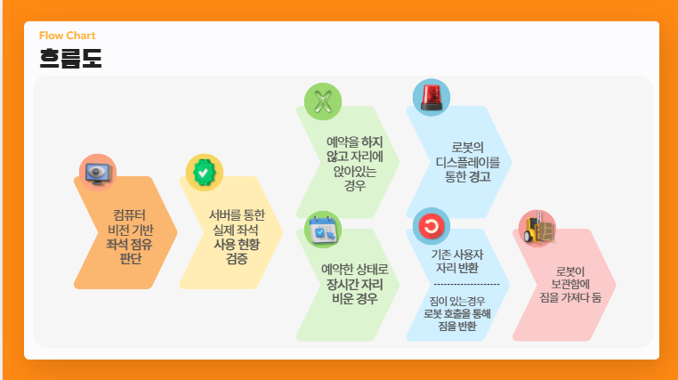

# 9월 셋째주 회의록(팀 주간 회의 14차) 20250918

날짜: 2025년 9월 18일
유형: 팀 주간 회의
참석자: 한주형, 장윤서, 김형진, 수민 김

## <비전·로봇 기반 자율 좌석 관리 시스템> 아이디어 발표 및 피드백

9월 둘째주 회의록(팀 주간 회의 12차)에서 확정 지었던 위 아이디어를 캡스톤 시간에 발표를 진행했고, 다음과 같은 피드백을 얻었다.

- 카메라를 통한 비전 인식은 사람의 얼굴을 찍어서 판단해야 하는데, 이러면 개인정보의 문제가 있을 수 있다.
- 도서관에서 테스틀 진행하고 예약 시스템에 간섭하기 위해선 행정적 문제가 발생할 수밖에 없다. 이러한 행정적 문제를 해결할 방안이 있는가? 또한 교수 입장으로써 도서관에선 해당 제품의 테스트 및 시연과 관련해서 허락을 절대 안 해줄것 같다.
- 로봇이 도서관 안에서 돌아다닐 때, 소음 문제가 발생할 수 있다. 이를 보완하기 위해 저소음으로 로봇을 설계한다면 그것만으로 일이다. 일단 모터값이 매우 비싸질테고 저소음으로 설계하는 것은 기계공학적 요소이기 때문에 해결하기에 어려울 것이다.
- 실제로 학교에서도 비콘인식 기반 좌석 비움 문제를 해결하려고 하고 있지만 정확도가 낮아 도입하지 못하고 있다.

피드백을 받은 후 우리의 결론

- 개인정보 문제, 행정적 문제와 같은 법적 문제를 대학생의 입장에서 해결할 수 없다. 또한 이를 피해 갈 뾰족한 수를 찾지 못했다.
- 비용과 같은 문제는 다른 대회에 같이 출전하여 예산을 따오거나 하는 등의 방안이 있고, 기계 공학적 요소 또한 주변 인맥을 이용하거나 개인 공부를 통해 어느 정도 보완할 수 있지만 위에서 말한 개인 정보 문제, 행정적 문제와 이로 인한 테스트 환경 미확보 문제가 매우 크리티컬하다고 판단
- 해당 아이디어를 보완/수정하는 것이 아닌, 새로운 아이디어를 찾고 발표하기로 결정

## <새롭게 정한 아이디어>

**주제:** 비 오는 날 하차 시 빗물 유입을 막는 **차문 에어커튼 모듈(Air Carbrella)**

**일시:** 2025년 9월 17일

---

## 1. 문제 인식 및 배경

- 비 오는 날 문을 여는 순간 **빗물이 실내로 들이쳐 시트가 젖고 승객이 비를 맞음**.
- 머리/메이크업/의상 손상으로 **출근·외출 만족도 하락**.
- 기존 유사 제품 **Carbrella(Brella Shield)** 는 **주차 중 태양열·자외선 차단용 썬셰이드**로, 하차 순간의 빗물 차단 문제를 해결하지 못함 → **문제·목적이 다름.**

---

## 2. 벤치마킹 요약(기존 제품 인사이트)

- **Carbrella**
    - 장점: 범용 사이즈, 소형 보관.
    - 불만: 접합부/손잡이 헐거짐, 내구 이슈 사례.
    - 시사점: 우리도 차종 범용성을 목표로 하되 내구 설계를 강화.
- **DoorBrella(호주)**
    - 장점: 손이 자유로움, 설치 간단.
    - 단점: 창문 조작 제약, 차종·우산 호환 편차, 고정력/내구 편차.
    - 시사점: 창문 기능에 간섭 없이, 우산 대신 공기층으로 차단, 모듈 고정력·내구 보완.

---

## 3. 프로젝트 목표

1. **에어커튼 방식으로 빗물 차단**: 문을 열면 상·측방 슬롯 노즐에서 공기를 분사해 **공기층(air curtain)** 형성.
2. **탈부착 모듈형(차종 범용)**: 클립/자석/VHB 브라켓 키트로 **대부분 차량**에 무가공 장착.
3. **완전 자동 동작**: 비 감지 + 문 개폐 감지 + 측풍 감지 → 버스트 운전 자동 수행.

---

## 4. 기술 스택

- **센서/감지**: 광학 레인센서 + 도어 스위치/핸들 터치 + 소형 차압(측풍) → 2-of-3 합의 + 히스테리시스.
- **임베디드 제어**: ESP32, PWM 제어, FreeRTOS 태스크, 과전류/과열 페일 세이프, 프리-스핀(200 ~ 300 ms).
- **구동부/노즐**: 소형 원심 블로어 ×2, 허니컴 스트레이트너, 슬롯 2 mm × 900 mm(상단) + 보조 슬롯. 드립엣지 병행.
- **기구/재질**: 방수 하우징, GF-나일론 브래킷, 이중전단 브래킷, TPE 슬리브로 진동 흡수.

---

## 5. 구현 근거(핵심 원리)

- **슬롯 제트(에어커튼/에어나이프)** + **코안다 립**으로 제트 직진성 확보, 허니컴으로 난류 억제.
- **드립엣지**로 큰 물줄기 외측 낙하

---

## 6. 1차 프로토타입

- 상단 슬롯 1줄 + 블로어 2기(중급 40–80 W급) + 허니컴 + 18 ~ 20° 외측 벡터링.
- 버스트 운전, 프리-스핀 적용.
- 브라켓 3종 → 클립/마그넷/VHB로 차종 적합성 평가.
- **예상 제작비**: 블로어·센서·3D프린트 포함 15–30만 원.

---

## 7. 테스트 계획 - 정량 지표

- **강우 재현:** 10/20/50 mm/h 살수 + 측풍 **3/6/8 m/s**.
- **성과 지표:**
    - 실내 유입수 저감율 **≥ 70%**(20 mm/h 기준)
    - 반응시간 **<** 300 ms
    - 제트 유속 12 ~ 15 m/s
    - 소음 **≤** 58 dBA
    - 방수 IP54**+**, 내구 **≥ 1,000회** 동작 무고장
- **방법:** 유입수량, 실내측 유속 맵, dBA, 소비전력 로깅.

---

## 8. 리스크 & 대응

- **소음/전력**: 다중 슬롯(유속 낮춤), 허니컴, 흡음 라이너, 버스트 운전.
- **측풍**: 노즐 각도 튜닝(15 ~ 25°) + B-필러 보조 슬롯 + 차압 기반 부스트 모드.
- **센서 오감지**: 2-of-3 합의 + 상승 150–300 ms 지연/하강 1–2 s 홀드, 주행·실내 조건 게이팅.
- **내구/헐거짐**: 나일록/로크타이트 + 이중전단 브래킷, GF-나일론.

---

## 9. 경쟁·차별 포인트 정리

- **Carbrella(Brella Shield)**: 주차 중 열차단(썬셰이드) — 하차 빗물 차단 아님.
- **DoorBrella**: 우산 고정 수동 액세서리 — 창문 제약·호환/내구 편차.
- **우리 모듈**: **완전 자동(비/문/풍) + 공기 제트로 빗물 차단 + 창문 기능 유지 + 범용 탈부착**..

---

✅ **결론**

Air Carbrella는 **비 오는 날 하차 순간**을 겨냥한 **완전 자동 에어커튼형 모듈**로, 기존 썬셰이드/우산 고정류와 목적·구현 방식이 다르다. **범용 장착·자동 제어를** 결합해, **실내 오염·사용자 불편**을 동시에 줄이는 실험·제작 가능 하도록 하는 것이 목표이다.