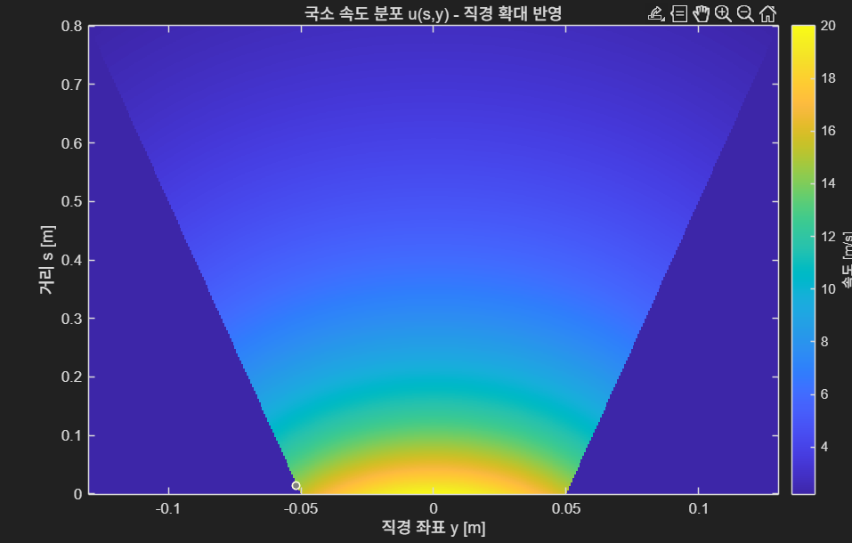
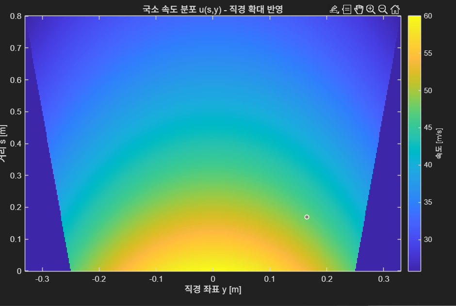

# 9월 다섯째주 회의록(팀 주간 회의 16차) 20251002

날짜: 2025년 10월 2일
유형: 팀 주간 회의
참석자: 한주형, 장윤서, 김형진, 수민 김

### <기능 리스트>

1. **Carbrella 모듈에서 출력하는 바람을 통해 비를 막는다**
    1. 시간당 20mm/h로 내리는 비를 바람을 통해 공기층을 형성하고 빗물의 진행 경로를 틀어 머리, 어깨, 시트의 젖음 정도를 최소화 한다.
    2. 사용자가 비를 맞지 않을 충분한 공간을 확보하여 우산을 피고 접는 과정에서 비를 맞지 않고 차량 출입이 가능하도록 한다
2. **사용자가 출력 되는 바람을 맞지 않도록 한다** 
    1. 사용자가 차량에 출입할 때 바람을 맞는다면 비도 맞고 바람도 맞아 불쾌감은 더욱 올라갈 것이다. 때문에 사용자가 출력 되는 바람에 맞지 않고 원활하게 차량 출입을 할 수 있도록 적절한 위치에 배치한다.
    2. 거리 감지 센서나 뎁스 카메라를 이용하여 사용자의 머리나 신체 일부가 바람이 출력되는 부분에 근접하거나 닿는다면 바람 출력을 멈출 수 있도록 한다.
    3. 다른 방안으로는 출력 되는 바람의 방향을 사람이 맞지 않도록 사람을 인식 후, 제트의 출력 방향 및 영역이 자동 조절되어 사람이 맞지 않도록 한다.
    4. 또 하나의 방안으로는 바람 출력 각도를 30도 정도로 높인 후 출력하여 사람의 머리와 같은 부분이 쉽사리 닿지 않도록 한다.
    5. 앞 문과 뒷 문에서 동시에 사람이 내릴 경우 주변 사람에게 제트에 대한 피해가 가지 않도록 설계한다.
    6. 차 문이 활짝 열리지 않도록 설계하여 바람으로 인해 밀린 물방울이 차 문에 묻지 않도록 한다.
3. **다양한 차량 종류에 탈부착이 가능하도록 한다.**
    1. 차들은 다양한 크기와 모양을 가진다.(세단, SUV, 승용차 등) 차량에 결합하는 베이스 플레이트나 마운트 베이스 부분을 유연하게 만들어 다양한 차량에 부착이 가능하도록 한다.
    2. 차량에 장착해도 창문 계폐, 문 여닫음, 차량 내부 센서에 간섭하지 않도록 설계한다.
    3. 사용하지 않을 땐 트렁크나 도어 포켓에 깔끔하게 보관할 수 있도록 컴펙트하게 디자인한다.
4. **모터 소리가 너무 크면 사용자가 깜짝 놀라거나 사용에 있어 불편함을 안길 수 있다.(너무 난이도가 높아진다 싶으면 빼도 될 듯)**
    1. 바람 출력으로 빗방울을 막기 위해선 강한 모터 출력이 필요하다. 모터 작동음을 최대한 막을 수 있는 모듈 구조를 설계하거나, 최대한 적은 모터 출력으로 강한 바람을 내보낼 수 있는 구조를 설계한다. → 소리와 같은 경우 특정 dBA를 기준으로 잡고 해야할 듯 함.
5. **오작동 방지**
    1. 잠깐의 물방울이 튀거나, 세차와 같은 상황을 비 오는 환경이라고 인식하여 오작동 하지 않도록 설계
6. **생활 방수와 내구성**
    1. 장마, 고온과 같은 환경에서도 안정적으로 작동하며, 여러 번의 탈부착에도 성능을 유지할 수 있도록 한다.
    2. 자가 점검 기능을 추가하여 필터 막힘, 내부 과부화 및 과열과 같은 상태를 스스로 인식하고 LED나 알림을 통해 사용자에게 알릴 수 있도록 한다.
    3. 문을 열고 사용자가 출입하는 짧은 시간만 강하게 동작하여 배터리 부담을 최소화하며 문 닫힘 후 절전 대기 모드를 통해 배터리 효율과 내구성을 최대화 한다.
    4. 비 오는 날, 차량이 빠른 속도로 달릴 때 노즐과 같이 구멍이 뚫려 있는 부분에 빗물이나 다른 이물질이 들어가지 않도록 구멍을 닫아 놓는다. →  제트 출력을 위해 동작할 때만 입구가 열리며 동작(자동으로 진행)

---

### <최종 선정된 기능 리스트 3가지>

1. **Carbrella 모듈에서 출력하는 바람을 통해 비를 막는다**
    1. 시간당 20mm/h로 내리는 비를 바람을 통해 공기층을 형성하고 빗물의 진행 경로를 틀어 머리, 어깨, 시트의 젖음 정도를 최소화 한다.
    2. 사용자가 비를 맞지 않을 충분한 공간을 확보하여 우산을 피고 접는 과정에서 비를 맞지 않고 차량 출입이 가능하도록 한다
2. **사용자가 출력 되는 바람을 맞지 않도록 한다** 
    1. 사용자가 차량에 출입할 때 바람을 맞는다면 비도 맞고 바람도 맞아 불쾌감은 더욱 올라갈 것이다. 때문에 사용자가 출력 되는 바람에 맞지 않고 원활하게 차량 출입을 할 수 있도록 적절한 위치에 배치한다.
    2. 거리 감지 센서나 뎁스 카메라를 이용하여 사용자의 머리나 신체 일부가 바람이 출력되는 부분에 근접하거나 닿는다면 바람 출력을 멈출 수 있도록 한다.
    3. 다른 방안으로는 출력 되는 바람의 방향을 사람이 맞지 않도록 사람을 인식 후, 제트의 출력 방향 및 영역이 자동 조절되어 사람이 맞지 않도록 한다.
    4. 또 하나의 방안으로는 바람 출력 각도를 30도 정도로 높인 후 출력하여 사람의 머리와 같은 부분이 쉽사리 닿지 않도록 한다.
    5. 앞 문과 뒷 문에서 동시에 사람이 내릴 경우 주변 사람에게 제트에 대한 피해가 가지 않도록 설계한다.
    6. 차 문이 활짝 열리지 않도록 설계하여 바람으로 인해 밀린 물방울이 차 문에 묻지 않도록 한다.
3. **모터 소리가 너무 크면 사용자가 깜짝 놀라거나 사용에 있어 불편함을 안길 수 있다.**
    1. 바람 출력으로 빗방울을 막기 위해선 강한 모터 출력이 필요하다. 모터 작동음을 최대한 막을 수 있는 모듈 구조를 설계하거나, 최대한 적은 모터 출력으로 강한 바람을 내보낼 수 있는 구조를 설계한다. → 소리와 같은 경우 특정 dBA를 기준으로 잡고 할 예정.
    

### <고려중인 추가 기능>

1. **다양한 차량 종류에 탈부착이 가능하도록 한다.**
    1. 차들은 다양한 크기와 모양을 가진다.(세단, SUV, 승용차 등) 차량에 결합하는 베이스 플레이트나 마운트 베이스 부분을 유연하게 만들어 다양한 차량에 부착이 가능하도록 한다.
    2. 차량에 장착해도 창문 계폐, 문 여닫음, 차량 내부 센서에 간섭하지 않도록 설계한다.
    3. 사용하지 않을 땐 트렁크나 도어 포켓에 깔끔하게 보관할 수 있도록 컴펙트하게 디자인한다.
2. **생활 방수와 내구성**
    1. 장마, 고온과 같은 환경에서도 안정적으로 작동하며, 여러 번의 탈부착에도 성능을 유지할 수 있도록 한다.
    2. 자가 점검 기능을 추가하여 필터 막힘, 내부 과부화 및 과열과 같은 상태를 스스로 인식하고 LED나 알림을 통해 사용자에게 알릴 수 있도록 한다.
    3. 문을 열고 사용자가 출입하는 짧은 시간만 강하게 동작하여 배터리 부담을 최소화하며 문 닫힘 후 절전 대기 모드를 통해 배터리 효율과 내구성을 최대화 한다.
    4. 비 오는 날, 차량이 빠른 속도로 달릴 때 노즐과 같이 구멍이 뚫려 있는 부분에 빗물이나 다른 이물질이 들어가지 않도록 구멍을 닫아 놓는다. →  제트 출력을 위해 동작할 때만 입구가 열리며 동작(자동으로 진행)

---

### <교수님 피드백>

- 첫 번째 기능
→ 말로 표현보단 그림으로 표현하여 나타내기(기능이 없을 때의 상황과 기능이 있을 때 상황)
- 두 번째 기능
→ 말로 표현보단 그림으로 표현하여 나타내기(기능이 없을 때 발생할 수 있는 문제점과 기능이 있을 때 보완되는 부분을 그림으로 나타내기)
- 세 번째 기능
→ 통과
- 차량에 붙일 수 있을 만큼 소형화 → 그러면 비를 못 막을 것 같다고 기계공학과 유체역학 교수님이 말씀해주심.
- 그림 넣어 보완한 후 파일만 다시 올리기 (발표 x)

---

### <유체역학 수식을 바탕으로 한 시뮬레이션 결과>

- 직경이 10cm인 모터를 사용했을 때, 20m/s의 풍속을 낼 수 있는 범위 → 10cm 정도의 범위로 결과 도출.

- 직경이 50cm인 모터를 사용했을 때, 20m/s의 풍속을 낼 수 있는 범위 → 25cm 정도의 범위로 결과 도출

- 해당 시뮬레이션 결과를 바탕으로 우리가 진행해야 할 상황>
    - 지름이 커질수록 단면적에 대한 효과가 줄어들어 중심 풍속을 잘 버텨낼 수 있다는 것을 도출 → 따라서 우리가 목적으로 하는 “소형화” 및 “모듈화”의 기준에 부합하는 한에서 최대한 크고 강한 바람을 내는 모터를 가지고 활용해야 함.
    - 또한 우리 제품에 맞는 노즐을 3D 모델링을 통해 만들고, 이를 통해 바람의 세기를 최대화 할 수 있는 방안을 찾아보았지만, 노즐이 존재하면 입구를 어떻게 만들면 마찰력으로 인한 풍속 감소 예상 → 이 부분을 앞으로 해결해야 할 문제
    - 실제로 200,000PRM으로 동작하는 풍속기 구매 후 샤워기, 세숫대야, 실제 빗물을 가지고 테스트 진행 → 실제로 물방울이 밀리는 범위가 크지 않고, 실제 빗물의 경우 자연으로 부는 바람 + 사선으로 내리는 빗방울과 같은 변수들로 인해 빗방울을 막을 수 있는 범위가 크지 않음을 확인. 또한 노즐을 장착했을 때 보다 장착하지 않았을 때가 효과가 더욱 좋은 것을 확인.