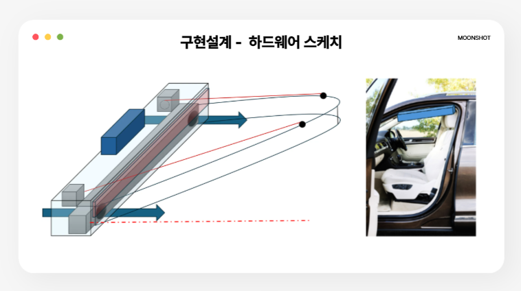

# 9월 일곱째주 회의록(팀 주간 회의 20차) 20251018

날짜: 2025년 10월 18일
유형: 팀 주간 회의
AI 요약: 기존 아이디어인 Carbellea는 차량 외부 설치 시 법적 문제로 인해 폐기되었고, 새로운 아이디어로 '라스트 마일 버디'라는 실내 전용 자율주행 로봇이 선정되었다. 이 로봇은 실내 배달의 지연 문제를 해결하고, 장애물 회피 및 안전한 물품 인도를 위한 기능을 갖추고 있으며, 1학기 동안 성능 평가 지표를 설정하여 검증할 계획이다.

### <기존 아이디어 폐기>

- 기존 아이디어인 Carbellea는 차량 외부에 장착하게 된다면 도로교통법에 걸린다는 문제가 있었다. 따라서 차량 내부에 설치하는 방향으로 가야 한다.
- 내부에 모듈을 설치한다면 설치해야 하는 부분과, 레인 실드를 다시 접어 모듈 안으로 접어오는 과정에서 실내에 물방울이 유입될 가능성을 배제할 수 없었다. 실내 모듈 설치를 해야 하는 이상, 실내 물방울 유입을 막는 것은 거의 불가능 하다고 판단했고 이러면 비를 깔끔하게 막아준다는 우리의 아이디어 목표에 어긋난다.
- 이러한 것들을 종합적으로 검토한 결과, 모듈 자체를 구현하는 것은 문제 없으나 모듈을 설치하고 사용자가 불편함 없이 설계하는 것은 무리가 있다고 판단했다.
- 또한 정량지표를 설정하고, 정량지표 도출을 위해 테스트 환경 구성이 이번 학기 당장 시연을 하기엔 무리가 있다고 판단했다.
- 이후 교수님과 미팅을 진행했고, 패널티를 감수하더라도 새로운 아이디어로 나아가기로 결정.

---

Moonshot팀 회의록

일시: 2025년 10월 18일
회의 주제: 아이디어 선정 및 기능 설계, 정량지표 설정

1️⃣ 회의 개요
- 이번 회의는 캡스톤 디자인 주제 선정 및 1학기 개발 목표 수립을 목적으로 진행
- 여러 아이디어를 검토한 끝에 ‘라스트 마일 버디(Last Mile Buddy)’를 최종 주제로 선정

2️⃣ 선정 아이디어 개요

주제: 실내 전용 라스트 마일 딜리버리 로봇

선정 배경 및 필요성:
•	기존 배달 서비스는 건물 내부 위치 정보 부족으로 인한 배송 지연 및 접근 제한 문제가 존재함.
•	실외 자율주행 로봇은 GPS 신호 차단으로 인해 실내에서는 사용이 어렵고, 실내·외 하이브리드 시스템은 비효율적임.
•	또한, 실외 데이터 기반 지도 저장 방식은 보안 및 개인정보 보호 측면에서 위험할 수 있음.
•	따라서 본 프로젝트는 특정 건물 내부 환경에 최적화된 실내 자율주행 로봇을 개발하여, 보안성과 실용성을 모두 충족시키는 솔루션을 제시하고자 함.

활용 가능 분야:
•	대학 캠퍼스, 병원, 숙박시설 등 실내 물류 이동이 빈번한 공간.
•	단순 배달뿐 아니라 문서 전달, 물품 운반 등 반복 업무 자동화에도 적용 가능.

3️⃣ 기능 설계 (기능적 요구사항)

a. 장애물 회피 (동,정적 장애물)
•	로봇이 사람의 개입 없이 실내 공간에서 경로를 스스로 탐색하고, 주행 중 마주치는 정적 장애물(벽, 가구 등)과  동적 장애물(보행자, 이동 물체 등)을 인식하여 안전하게 회피한다.

- 정적 장애물 회피 : 건물 내부에는 로봇이 다닐 수 없는 구조물이나 구역이 존재한다. 이런한 것들을 라이다 및 카메라를 통해 인식하고 부딪히지 않도록 경로를 설정한다.
- 동적 장애물 회피:
    - 카메라에 충분한 거리를 두고 등장하는 경우
        
        : 통행하는 사람과 부딪히지 않도록 한다. 또한 사람의 통행 방해를 최소화 할 수 있도록 사람을 피해 갈 수 있도록 한다. 이는 사람이 진행하는 방향을 예측하고 계산하여 피해갈 수 있도록 경로 재탐지를 통해 진행한다.
        
    - 카메라 사각지대에서 갑자기 등장하는 경우
        
        : 로봇을 기준으로 안전거리 이내에서 사람이 갑작스럽게 등장하는 경우, 이를 빠르게 인지하고 정지하여 사람과 부딛히지 않도록 한다.
        

b. Point-to-Point 배달 (Direct P2P Delivery)
•	사용자는 도착지만 지정하면, 로봇이 스스로 경로 판단 및 주행 수행.

- 중간 경유지 설정 가능 : 택배 배송을 가는 길에 배송할 곳이 있으면 중간 경유지에  택배 배송 후, 다시 출발할 수 있도록 한다.
- 목적지까지 짐을 자동 배달 할 수 있도록 한다.
- 층 수에 상관없이 엘레베이터를 타고 이동 가능

c. 안전한 물품 인도 및 보안 관리 (Secure Delivery)
•	잠금형 수납함 탑재 → 인증된 사용자만 접근 가능.
•	물품 인도 시 사용자 인증 및 로그 기록으로 분실·오배송 방지.

- 키패드 인터페이스 : 발송자는 수신 호실을 입력해 배송을 요청하고, 수신자는 도착 후 비밀번호를 통해 물품을 수령한다.,
- 잠금형 수납함 : 인증이 완료되면 전자식 잠금 장치가 자동으로 해제되며, 수령 완료 시점에 자동으로 재잠금되어 무단 접근을 방지한다.,
- 이력 기록 및 알림 기능 : 인도 시각, 수령자 정보, 위치 정보가 자동으로 서버에 저장되며, 이상 상황(예: 인증 실패, 수납 미닫힘 등) 발생 시 배송자에게 알림이 전송된다.

4️⃣ 1학기 정량적 평가 지표 (Quantitative Metrics)

a. 단일 층 내 Point-to-Point 자율주행 성능 평가

측정 목표:
•	하나의 층 내에서 로봇이 지정된 출발지~도착지 간을 안정적으로 이동할 수 있는지 검증.

측정 방법:
•	동일 층 내 최소 3개 이상의 포인트를 설정하여, 로봇이 순차 이동 실험 수행.
•	정적 장애물(가구, 벽) 및 동적 장애물(보행자 등) 회피 성능 평가.

성공 기준:
•	모든 포인트 간 이동이 중단 없이 완료, 장애물 회피 및 경로 복귀 정상 작동.
•	위치 오차 ≤ 1.5m

실패 기준:
•	충돌, 정지, 목적지 미도달 등.

b. 엘리베이터 탑승 및 층 인식 기능 검증

측정 목표:
•	엘리베이터 이동 중 로봇이 현재 층을 정확히 인식할 수 있는지 확인.

측정 방법:
•	로봇이 자율주행으로 엘리베이터 문 앞 접근 → 탑승 후 엘리베이터 이동(수동 조작).
•	이동 중 자이로, 가속도계, 카메라 데이터를 기반으로 층 이동 감지 알고리즘 검증.
•	실제 층수와 로봇 인식 층수를 비교.

성공 기준:
•	실제 층 이동 결과와 인식 결과가 100% 일치.

실패 기준:
•	센서 오차 또는 층 이동 인식 실패.

- 차기 회의 일정
•	다음 회의: 2025년 10월 22일 예정