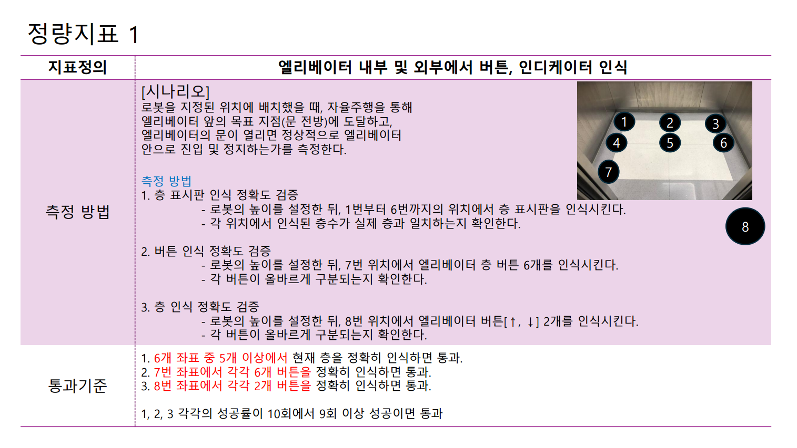
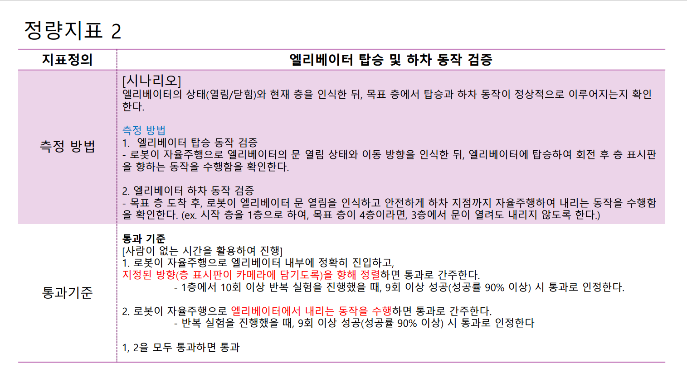
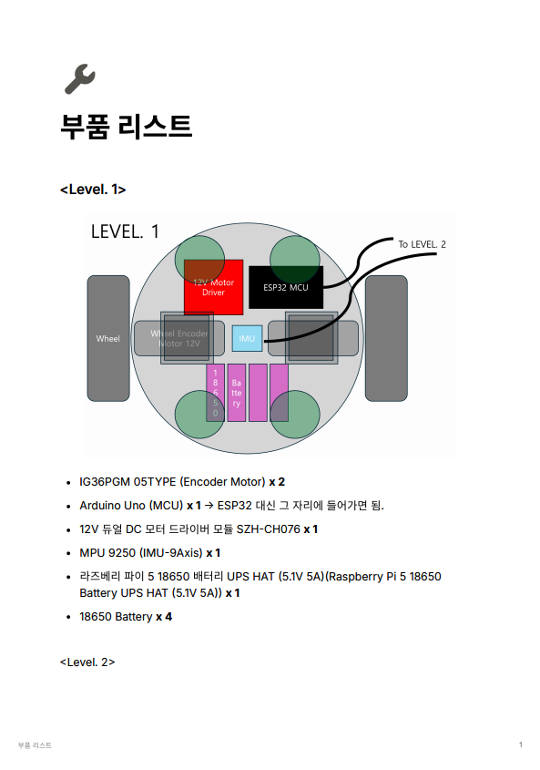
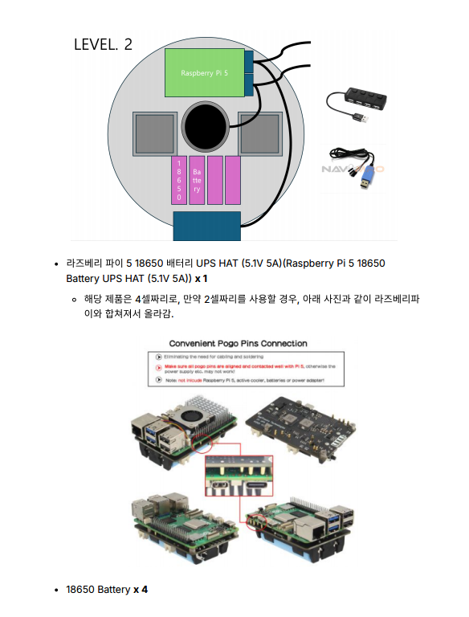
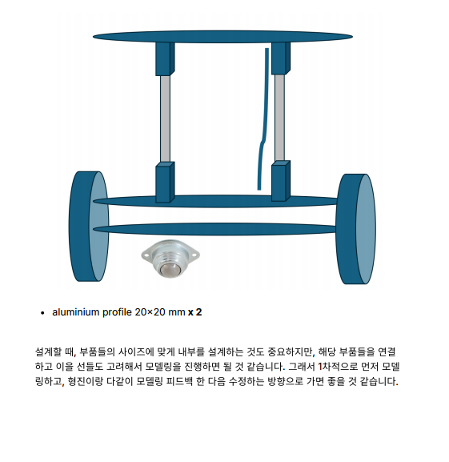

# 9월 여덟째주 회의록(팀 주간 회의 22차) 20251023

날짜: 2025년 10월 23일
유형: 팀 주간 회의
AI 요약: 회의에서는 로봇의 엘리베이터 인식 및 탑승/하차 동작 검증을 위한 정량지표를 설정하고, 각 지표의 통과 기준을 정의하였다. 부품 리스트와 설계 메모도 포함되어 있으며, 부품의 배치와 연결을 고려한 모델링이 중요하다고 강조되었다.
참석자: 한주형, 장윤서, 김형진, 수민 김

## <정량지표 구체화>

### 정량지표 1 — 엘리베이터 내부·외부 버튼/인디케이터 인식

### 시나리오

로봇을 지정된 위치에 배치한 뒤 **자율주행**으로

① 엘리베이터 앞 목표 지점(문 전방)에 도달, ② 문이 열리면 정상적으로 엘리베이터 안으로 진입 및 정지/정렬하는지를 측정.

### 측정 방법

1. **층 표시판 인식 정확도 검증**
- 로봇 높이 고정 후 **1번~6번 위치**에서 층 표시판을 각각 인식.
- 각 위치에서 인식된 **층수**가 실제 층과 일치하는지 확인.
1. **버튼(층 버튼) 인식 정확도 검증**
- 로봇 높이 고정 후 **7번 위치**에서 엘리베이터 **층 버튼 6개**를 인식.
- 각 버튼이 **올바르게 구분**되는지 확인.
1. **상/하 방향 버튼 인식 정확도 검증**
- 로봇 높이 고정 후 **8번 위치(홀 콜 버튼)**에서 **상(↑), 하(↓) 2개 버튼**을 인식.
- 두 버튼의 **정확한 구분** 여부 확인.

> 좌표 개념: 내부 바닥에 1~7번 위치가 배치되어 있고, 8번은 외부 홀 콜 영역.
> 

### 통과 기준

- **1.** 6개 좌표 중 **5개 이상**에서 현재 층을 정확히 인식 → **통과**
- **2.** 7번 좌표에서 **6개 층 버튼**을 정확히 인식 → **통과**
- **3.** 8번 좌표에서 **상/하 2개 버튼**을 정확히 인식 → **통과**
- 위 **1·2·3 각각**에 대해 **10회 중 9회 이상 성공** 시 해당 항목 **통과**

---

### 정량지표 2 — 엘리베이터 탑승 및 하차 동작 검증

### 시나리오

엘리베이터의 상태(열림/닫힘)와 **현재 층**을 인식한 뒤, **목표 층에서의 탑승/하차 동작**이 정상적으로 수행되는지 확인.

### 측정 방법

1. **탑승 동작 검증**
- 자율주행으로 문 **열림 상태**와 **이동 방향**을 인식.
- 엘리베이터에 **탑승 → 회전 → 층 표시판을 향해 정렬**하는지 확인.
1. **하차 동작 검증**
- 목표 층 도착 후 문 **열림 인식**, **안전한 하차 지점**까지 자율주행하여 **하차** 동작 수행.
- 예: 시작 1층, 목표 4층이면 **3층에서 문이 열려도 내리지 않도록** 제어 확인.

### 통과 기준 *(사람이 없는 시간 활용)*

- **1. 탑승·정렬**: 자율주행으로 내부에 정확히 진입하고, **층 표시판이 카메라에 담기도록** 지정된 방향으로 정렬.
    - **1층 기준 10회 반복**, **9회 이상 성공(≥90%)** 시 **통과**
- **2. 하차**: 자율주행으로 **내리는 동작**을 수행.
    - **10회 반복**, **9회 이상 성공(≥90%)** 시 **통과**
- **1, 2 모두 통과**하면 전체 **통과**

---

## 부품 리스트

### Level 1 (하부 플랫폼)

- **IG36PGM 05TYPE (Encoder Motor)** × **2**
- **Arduino Uno (MCU)** × **1** → 필요 시 **ESP32**로 대체 가능
- **12V 듀얼 DC 모터 드라이버 모듈 SZH-CH076** × **1**
- **MPU-9250 (IMU, 9-Axis)** × **1**
- **Raspberry Pi 5 18650 Battery UPS HAT (5.1V 5A)** × **1**
- **18650 Battery** × **4**

> 배치 개념(도식 기준):
> 
> - 중앙: **Wheel Encoder Motor 12V**(좌/우), **IMU**
> - 상단: **12V Motor Driver**, **ESP32 MCU**
> - 하부 중앙: **18650 배터리 팩**
> - 상부로 **To LEVEL 2** 배선 연결

### Level 2 (전원/상부 플랫폼)

- **Raspberry Pi 5 18650 Battery UPS HAT (5.1V 5A)** × **1**
    - 해당 제품은 **4셀** 구성. **2셀** 사용 시, 안내 이미지처럼 **라즈베리파이와 합체**되어 장착됨(포고핀 연결).
- **18650 Battery** × **4**

### Level 3 (탑재 센서/프레임)

- **Raspberry Pi 5 + Fan (SBC)** × **1**
- **RPLIDAR C1 (2D LiDAR)** × **1**
- **알루미늄 프로파일 20×20mm** × **2**

### 설계 메모

- 부품 **사이즈와 배선/연결**을 함께 고려한 모델링이 중요.
- **1차 모델링**을 먼저 진행한 뒤, 팀원(현진 등)과 **피드백 후 수정**하는 방식으로 진행.