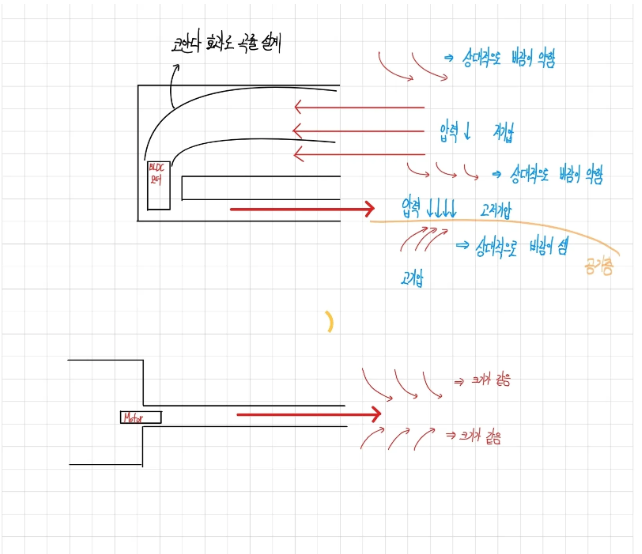
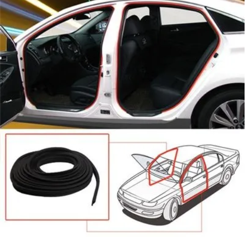
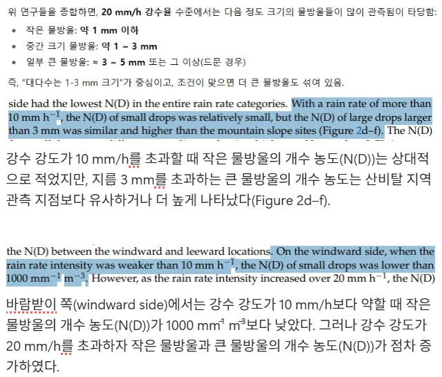

# 9월 넷째주 회의록(팀 주간 회의 15차) 20250925

날짜: 2025년 9월 25일
유형: 팀 주간 회의
참석자: 한주형, 장윤서, 김형진, 수민 김

### 지난주 발표했던 “비 오는 날 하차 시 빗물 유입을 막는 **차문 에어커튼 모듈(Air Carbrella)”에 대한 아이디어 승인 → 기능 리스트 및 구현 가능성 검토 진행**

### 아이디어 개요

- 차량 문 개구부에서 실내로 빗물이 유입되는 문제를 해결하기 위해 **에어커튼(Air Curtain)** 원리를 적용.
- **좁은 노즐 + 코안다(Coandă) 효과**를 활용하여 제트 바람을 차량 외측으로 유도.
- 장착 위치: 창문 틈새(웨더스트립) 또는 B-필러 부근 → 빗방울을 바람으로 밀어내는 방식.

---

### 빗방울 특성 분석

- **크기 분포**: 주로 1~3 mm (3 mm 빗방울 질량 ≈ 0.014 g).
- **종단 속도**:
    - 2 mm ≈ 7 m/s
    - 3 mm ≈ 9 m/s
    - 대형 방울은 ~10 m/s 근접.
- **강수 강도 영향**:
    - 강수 강도 10 mm/h 초과 시, 3 mm 이상 대형 방울 농도 ↑.
    - 강수 강도 20 mm/h 초과 시, 소형·대형 방울 모두 개수 농도 ↑.
    
    
    

---

### 설계 목표 및 요구 성능

- **노즐 출구 바람 속도**:
    - 기본: 12~15 m/s
    - 측풍 고려: 18~20 m/s
- **제트 각도**: 차량 외측으로 18~22° 기울여 측풍 대비.
- **작동 방식**: 차량 문 열림 + 비 감지 → 빠른 팬 구동.

---

### 적용 기술 원리

- **코안다 효과**: 제트가 표면을 따라 휘어지며 외측 커튼 형성.
- **난류 및 제트 확산**: 좁은 슬롯 노즐로 고속 제트 형성.
- **동압(Dynamic Pressure)**: 빗방울을 가로로 밀어 궤적 변경.

---

### 설치 위치

- **웨더스트립 외곽 라인**
- **B-필러 보조 슬릿** (차량 구조 간섭 적음)
- 차량 내부

[여유가 된다면 세 가지 경우 전부 테스트 할 예정]

---

### 벤치마킹 사례

- **다이슨 V9 모터**: 초고속 BLDC (110,000 rpm) + 공기 증폭 기술 → 강력한 제트.
- **Air Knife 시스템**: 세차 건조 장치에 활용, 균일한 에어시트 형성.
- **Carbrella**: 차량용 공기 차단기 특허 및 시제품 사례.

---

### 설계 시 고려 사항

- 소음 최소화 및 바람 직진성 확보.
- 차량 배터리 vs 별도 배터리 사용 여부 결정.
- 사용자 불편 최소화 (옷/머리카락 날림 방지).
- **빗물 센서 + 문 열림 감지 센서** → 자동 제어 필요.
- **재료 후보**: 동관 + PVC 파이프, 에어 커플러, CF 밸브소켓.

---

### 결론

- 본 설계는 차량 문 개방 시 빗물 유입을 **효과적으로 차단**할 수 있는 **공기 흐름 기반 시스템**.
- 강우 강도 20 mm/h 수준에서도 12~20 m/s 바람으로 빗방울을 막음.
- 제트 방향을 외측으로 기울여 **안정적 에어커튼 형성**.
- 향후 시제품 제작:
    - 3D 프린팅 노즐
    - BLDC 또는 원심 블로어 기반 팬
    - 비 감지 센서 결합 프로토타입 제작 및 성능 검증 예정.

---

### 다음주 진행할 과제

- 알리익스프레스에서 구매한 200000BPS 속도의 모터를 이용하여 어느 정도의 물방울까지 막아지는지 실험
- 3D 모델링을 통한 여러가지 노즐 설계
- 기능 리스트 구체화