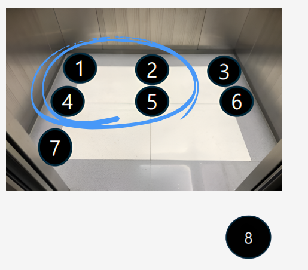
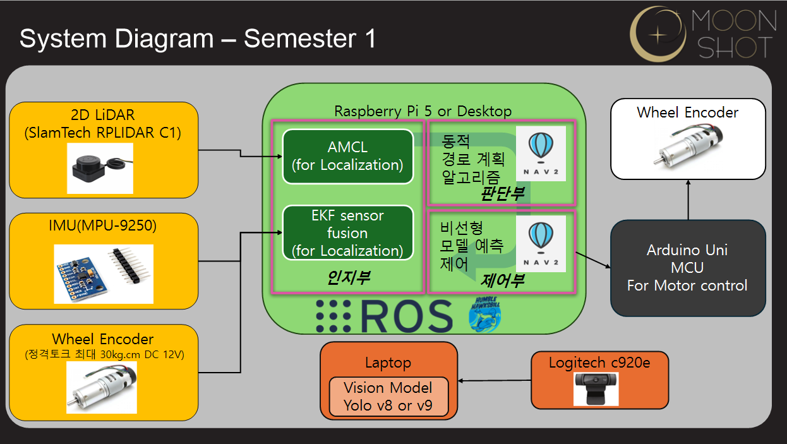

# 9월 아홉째주 회의록(팀 주간 회의 24차) 20251030

날짜: 2025년 10월 11일
유형: 팀 주간 회의
AI 요약: 회의에서는 엘리베이터의 버튼 인식률과 탑승 및 하차 동작 성공률을 측정하기 위한 시나리오와 방법을 구체화하였다. 사람의 유무에 따른 인식 정확도와 통과 기준을 설정하고, 로봇의 경로 계획 및 충돌 회피 방안을 논의하였다. 또한, 하드웨어 및 소프트웨어 구성 요소에 대한 진행 상황과 향후 작업 계획이 포함되었다.
참석자: 한주형, 장윤서, 김형진, 수민 김

## <정량지표 세분화 및 구체화 - 사람 0명, 1명, 2명일 경우 추가>

### 정량지표-1｜엘리베이터 **내부·외부 버튼 인식률**

### 1) 시나리오

- 로봇이 엘리베이터 앞에 도착했을 때 **8번 위치**에서 외부 호출 버튼 [↑], [↓]의 활성/비활성 여부를 인식한다.
- 엘리베이터 안으로 진입하면, 1·2·4·5번 위치(층 인식 가능 포인트)에서 층 버튼(B1~5층)의 활성/비활성 여부를 판단하고, 로봇 목적층의 버튼이 활성화되어 있는지 확인한다.
- 아래 **세 가지 상황**을 가정해 각 경우의 **인식 여부와 정확도**를 측정한다.
    1. 사람이 없는 경우
    2. 사람이 1명인 경우
    3. 사람이 2명인 경우

---

### 2) 측정 방법 — **외부**

1. **외부 호출 버튼 인식 정확도(가능 시)**
    - 8번 위치에서 **[↑], [↓]** 버튼의 **활성/비활성** 여부 인식.
    - 인식 결과가 실제 버튼 상태와 **일치**하는지 확인.
2. **사람이 앞을 막고 있는 경우(1명/2명 동일 절차)**
    - 사람을 **장애물로 판단**, 좌측으로 **약 20 cm 회피 이동**.
    - 여전히 버튼 인식이 불가하면 **음성 안내**로 잠깐 공간을 비켜 달라거나 버튼을 눌러 달라고 요청.

---

### 3) 측정 방법 — **내부 (층 버튼 6개, B1~5층)**

2-1. **사람이 1명 있을 때**

- 1, 2, 4, 5번 중 **버튼이 정확히 보이는 포인트**로 이동하여 인식.
- 사람이 7번 위치(버튼 바로 앞)에 있으면 **음성 안내**로 공간 확보 요청.

2-2. **사람이 2명 있을 때**

- 1, 2, 4, 5번 중 **사람이 가리지 않는 포인트**로 이동하며 인식.
- 이동 중 **무작위 위치의 다른 사람**과 부딪히지 않도록 경로 선택.
- 사람이 7번 위치에 있으면 **음성 안내**로 공간 확보 요청.

---

### 4) **통과 기준 (정량지표-1)**

### 외부(8번 위치)

- (1-1) **[↑], [↓]** 두 버튼의 활성/비활성 **정확 인식**
- (1-2) **사람 감지 및 회피 동작** 수행(1명/2명 동일)
- **10회 중 9회 이상(≥90%) 성공** 시 통과

### 내부(1·2·4·5번 위치)

- 각 위치에서 목적층 버튼(B1~5층)의 **활성/비활성 정확 인식**
- <내부에 사람이 1명>
    - 사람이 4번 포인트에 있으면 로봇은 **1→2→5번(또는 2→5번) 최적 경로**로 이동하여 인식
    - 사람이 7번 위치에 있으면 **음성 안내**로 공간 확보 요청
    - **10회 중 8회 이상(≥80%) 성공** 시 통과 *(두 케이스 합산 10회 진행)*
- <내부에 사람이 2명>
    - 1, 2, 4, 5번 중 **가리지 않는 지점**으로 이동해 인식
    - 이동 불가 시 **음성 안내**
    - **10회 중 8회 이상(≥80%) 성공** 시 통과 *(두 케이스 합산 10회 진행)*

---

### 정량지표-2｜엘리베이터 **탑승 및 하차 동작 성공률**

### 공통 목표

- **문 열림/닫힘**과 **현재 층**을 인식한 뒤, **목표 층에서 탑승 및 하차 동작**이 정상적으로 수행되는지 확인

---

### A. **사람 0명** 시나리오

### 측정 방법

1. **탑승 동작 검증**
- 문 **열림 상태**와 **방향**을 인식 → **탑승** → **회전 후 층 표시판**을 향해 정렬
1. **하차 동작 검증**
- 목표 층 도착 후, **층과 문 열림**을 인식 → **안전한 하차 지점**까지 자율주행하여 **하차**
- 테스트 경로 예시(양방향):
    - B1↔1층, B1↔2층, B1↔3층, B1↔4층, B1↔5층
    - 5↔4, 5↔3, 5↔2, 5↔1, 5↔B1
- 예: 시작 1층·목표 4층일 때 **3층에서 문이 열려도 내리지 않도록** 테스트

### 통과 기준

- **탑승 정렬**: 1층에서 **10회 반복**, **9회 이상(≥90%) 성공** 시 통과
- **하차**: **10회 반복**, **9회 이상(≥90%) 성공** 시 통과

---

### B. **사람 1명** 시나리오

### 측정 방법

1. **사람이 탑승 대기**
    - 사람이 대기 중인지 인식
    - 사람이 먼저 탑승하면 로봇이 **추가 간주** 후 탑승, 일정 시간 내 미탑승 시 **미탑승 간주**
    - 사람이 문 앞을 막으면 **음성 안내**로 공간 확보 요청
2. **사람이 탑승해 있는 경우**
    - 사람이 1명 내부에 그대로 있으면, **1·2·4·5번 포인트** 중 적절한 위치를 선택해 **부딪힘 없이 탑승**
3. **사람이 하차하는 경우**
    - 엘리베이터 내 **사람 탑승 여부** 인식
    - 사람이 먼저 하차하면 로봇이 **추가 간주** 후 탑승/하차 동작 진행
    - 일정 시간 내 미하차 시 **미하차 간주**

### 통과 기준·측정 조건

- **9회 중 8회 이상(≥88.9%) 성공** 시 통과
- **임의의 한 층**에서만 진행, 각 측정 방법을 **3회씩** 수행

---

### C. **사람 2명** 시나리오

### 측정 방법

1. **사람 2명 탑승 대기**
    - 2명이 먼저 탑승하면 로봇은 **부딪힘 없이 간주 후 탑승**
    - 일정 시간 내 미탑승 시 **미탑승 간주**
2. **사람 2명 하차**
    - 내부 사람 인식 → 2명이 먼저 하차 시 로봇이 **간주 후 탑승 동작** 진행
    - 일정 시간 내 미하차 시 **미하차 간주**
3. **사람 2명 내부 대기(혼잡)**
    - 사람 1명만 나가고 1명은 남아 있을 때, **나올 때까지 대기 후 탑승**
    - **1·2·4·5번** 중 **적절한 포인트**를 선택해 정렬/탑승
    - 적절 포인트가 없으면 **음성 안내**로 자리 확보 요청
4. **1명은 내부 유지, 1명은 하차**
    - 먼저 나오는 1명이 **완전히 나온 뒤** 탑승을 시도
    - 남아 있는 1명을 인식하고 **1·2·4·5번** 포인트 중 적절 위치에 정렬

### 통과 기준·측정 조건

- **8회 중 5회 이상(≥62.5%) 성공** 시 통과
- **임의의 한 층**에서만 진행, 각 측정 방법을 **2회씩** 수행

---

### 비고/운영 메모

- **충돌 회피**: 모든 케이스에서 사람을 **동적 장애물**로 처리, 최소 안전거리 확보
- **음성 안내 문구**: “죄송합니다. 버튼 인식/탑승을 위해 잠시만 공간을 비켜 주세요.”
- **로그**: 케이스·시도 번호·성공/실패·원인(가림/미인식/경로불가/시간초과 등) 기록

---

## 작업 진척도

### System Diagram

- **메인 컴퓨팅**: Raspberry Pi 5 *또는* Desktop (ROS2 Humble + Nav2)
- **인지부**
    - **AMCL** (Localization)
    - **EKF Sensor Fusion** (IMU·Wheel Encoder·LiDAR 융합)
- **판단부**
    - Nav2 기반 **동적 경로 계획 알고리즘**
- **제어부**
    - Nav2 + **비선형 모델 예측 제어(MPC)** 개념 반영
- **센서/액추에이터**
    - **2D LiDAR**: SlamTech RPLIDAR C1
    - **IMU**: MPU-9250
    - **Wheel Encoder**(정격토크 최대 30 kg·cm, DC 12 V)
    - **카메라**: Logitech c920e (외부 노트북 연결)
- **보조 연산(노트북)**: Vision Model (**YOLOv8/v9**) 실행 → 인식 결과 ROS 토픽으로 전달
- **하위 제어**: Arduino Uno MCU(모터 제어) ← 엔코더/드라이버와 직결

---

### Firmware

- **구성**
    - 엔코더 모터 **12 V 1/19 기어비** ×2
    - **Arduino Uno**(모터 제어)
    - **12 V 2채널 모터드라이버**
    - **18650 Li-ion 배터리 6셀** 직병렬 구성(표시)
- **상태**
    - 기본 배선 완료, 모터 구동 및 방향 제어 확인 예정(엔코더 카운트 인터럽트·속도 PID 추후 연동)

---

### Hardware

- **상·하층(LEVEL 2/LEVEL 1) 분리 구조**
    - LEVEL 2: **Raspberry Pi 5**, 배터리 팩, 허브/동글 배치
    - LEVEL 1: **모터 드라이버**, **MCU(ESP32 대체 가능)**, IMU, 엔코더 모터 배치
- **프레임**: 알루미늄 프로파일/지주 사용, **상판·하판 원형 데크** + **지주 4개**로 고정
- **하부**: 바퀴/휠, 하부 센서(예: LiDAR) 장착 영역 표시
- **설계 원칙**: “일정 관계상 구성 가능한 **최대 옵션** 기준”으로 모듈러 설계

---

### Hardware

- **원형 하단 베이스 모델** 1차 완성
    - 직경·두께 등 **주요 치수 스케치 구속** 완료
    - 내부에 **모터 축 결합용 직사각형 홈** 및 **외곽 플랜지** 포함
    - 상단 커버 체결 가능한 **볼트 패턴** 반영
    - 내부 수납 공간 확보(배터리 팩·드라이버·MCU 안착 고려)
- **다음 작업**
    - 상단 구조물(카메라/라즈베리파이 고정부) 설계 및 체결 방식 정의

---

### Robot Software (Vision)

- **RViz 실시간 확인 화면**
    - 엘리베이터 **층 버튼(B1~5층) 탐지** 박스 표시
    - **외부 호출 버튼(↑/↓) 인식** 예시
    - **엘리베이터 도어/프레임 검출** 및 위치 피드백
- **모델 학습/검증 지표**
    - 학습 커브(Precision/Recall/Loss) 안정화 추세
    - Roboflow/플랫폼 상 **배포 프리뷰** 스냅샷 포함

---

### Robot Software (Autonomous Driving)

- **Nav2 시뮬레이션**
    - 맵 상 **장애물/경로 플래닝** 시각화(파란 경로, 목표 지점)
    - **TF 프레임**과 로봇 자세(오도메트리) 확인
- **조작**: 텔레옵 키보드/패드로 테스트 후 자율주행 전환

---

### 메모

- [ ]  Arduino 엔코더 인터럽트 + 속도 PID 정수화(타이머 주기/단위 통일)
- [ ]  IMU 캘리브레이션(바이어스/Soft-Iron) → EKF 파라미터 튜닝
- [ ]  LiDAR C1 드라이버 ROS2 패키지 버전 고정 및 프레임 정합(`base_link`/`laser`)
- [ ]  YOLO 모델 입력 해상도/전처리 파이프라인 고정 → ROS 메시지 변환 지연 최소화
- [ ]  상·하층 배선 다이어그램 확정(전원/신호 구분, GND 스타 접지)
- [ ]  CAD: 상판 카메라 브래킷, RPi5 냉각/UPS HAT 체결홀 반영
- [ ]  안전 규격: 배터리 퓨즈/차단 스위치, 전류 용량 검증(피크 전류 포함)