# 팀 주간 회의 10차(아이디어 선정 및 구체화를 통한 발표 준비) @2025년 9월 3일 20250903

날짜: 2025년 8월 27일

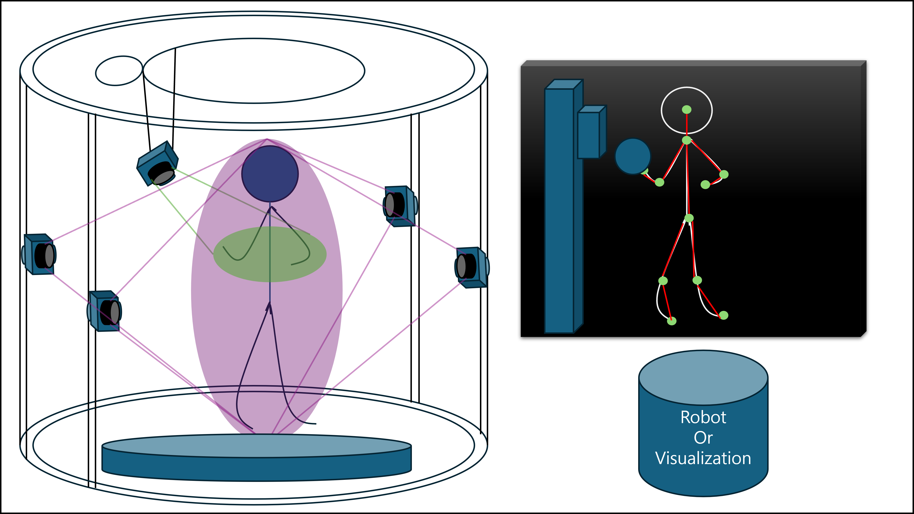

**아이디어 생성 이유** : 한국의 변화하는 정책으로 기업들은 점점 사람들을 구인하지 않으려고 하며, 현재 현장에서 종사하고 있는 사람들조차 해고를 당하며 그 자리가 로봇으로 채워지고 있다. 실제로 국내에선 현대차, 삼성, 포항제철 등 생산 라인에 사람 대신 로봇이 일할 수 있도록 연구하며 방법을 찾고 있다. 해외의 경우에는 국내보다 진행 상황이 더욱 빠르다. 테슬라와 도요타는 휴머노이드 로봇을 현장에 배치하기 위해 조금씩 사범 시행 중이며, 많은 투자를 진행하고 있다. 중국의 경우에는 휴머노이드 로봇의 강국이라고 불리는 미국을 앞서 휴머노이드 개발 및 도입을 시행하고 있다. 

시대는 점점 위와 같은 방향으로 변화하고 있고, 이에 우리는 변화하는 시대 상황에 맞춘 아이디어를 고민하기 시작했다. 그러던 도중, 휴머노이드 로봇이 투입 된다고 해서 정말 인간이 아예 필요 없을까?라는 의문을 던졌다. 

그 결과 우리는 “휴머노이드 로봇이 생산 과정의 대부분을 대체할 순 있어도 인간의 휴리스틱한 작업이 필요한 특정 상황에선 인간이 개입 되어야 하는 상황이 분명이 존재할 것”이라는 결론을 내렸다.

따라서 평시에는 휴머노이드 로봇이 일하며, 인간이 필요한 특수한 상황에선 인간이 로봇을 원격으로 조정하여 해당 문제 상황을 해결할 수 있도록 하자는 아이디를 도출했다. 

아이디어의 핵심은 디지털 트윈을 이용하는 것이다. 카메라와 여러 센서를 통해 사람의 동작 즉, 모션 캡쳐를 따고 이것을 디지털 트윈을 이용하여 디지털 세계에서의 “나”를 생성한다. 이렇게 디지털 세계에서 만들어진 “나”는 현실 세계에서의 나의 동작을 그대로 따라한다. 디지털 세계에서의 “나”에 대한 정보는 다시 현장에서 일하고 있는 휴머노이드 로봇한테 정보가 넘어가 현실 세계의 “나”에 대한 동작을 그대로 따라하여 해당 문제 상황을 해결할 수 있도록 한다.

만약 이것에 실현되고, 적용이 된다면 사람은 집이나 현장에서 떨어진 다른 실내 공간에서 일을 하다가 인간이 필요한 상황에 대한 알림이 오면 디지털 트윈 방식을 이용하여 현장에서의 문제를 휴머노이드 로봇이 처리할 수 있게 된다.

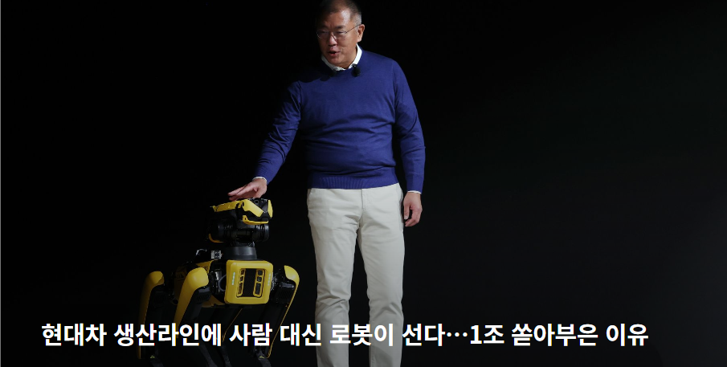

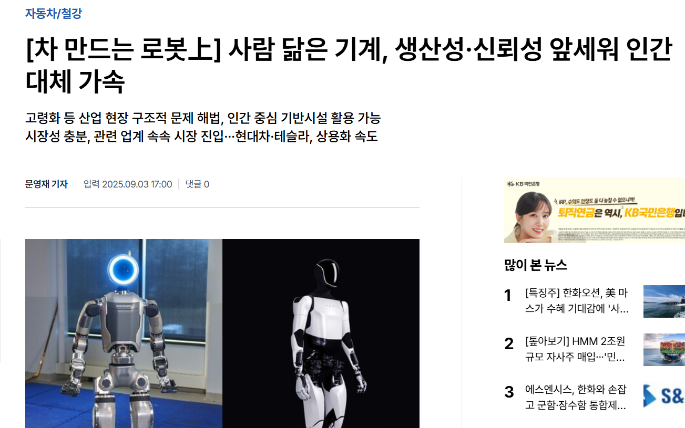

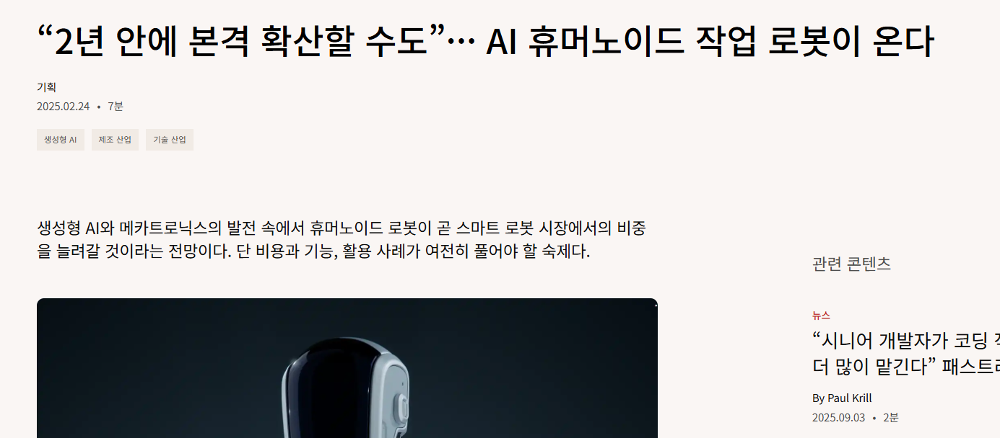

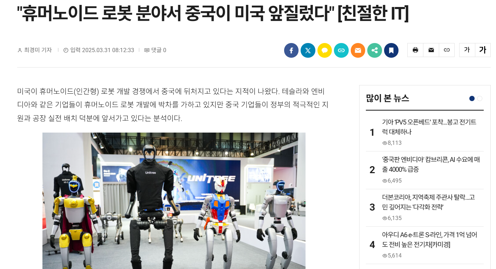

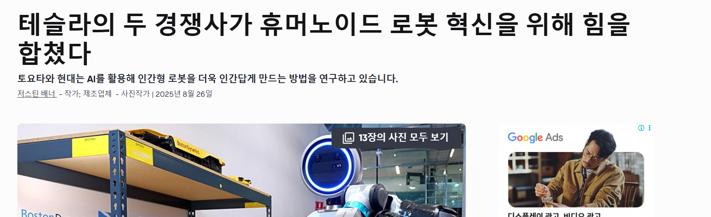

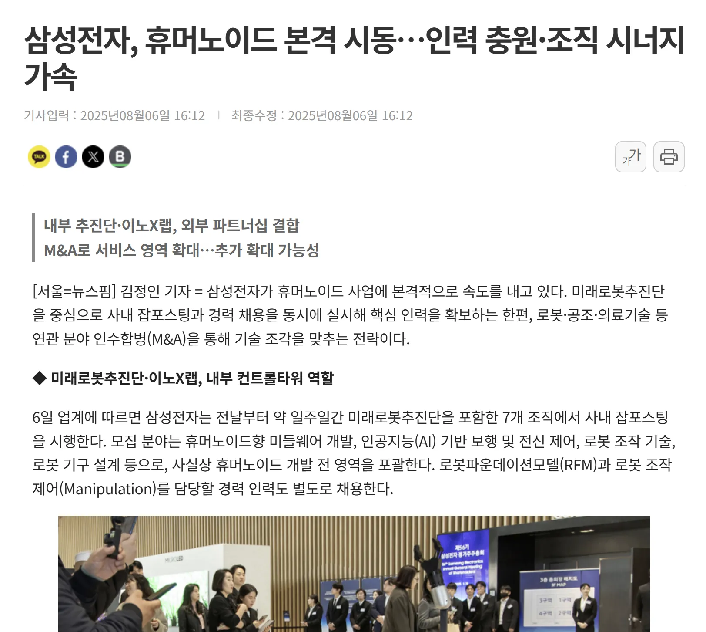

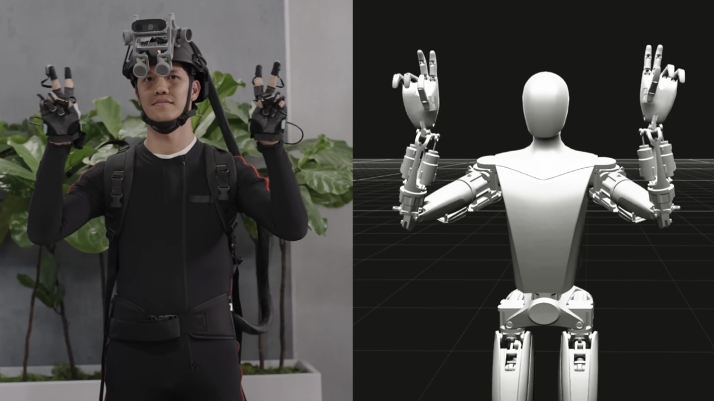

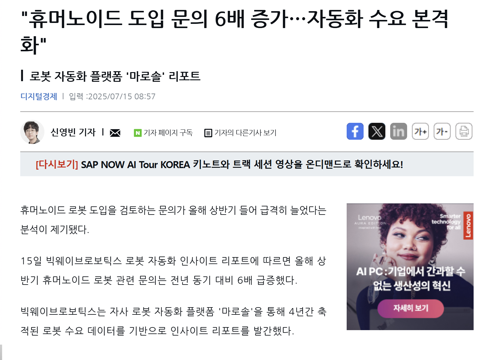

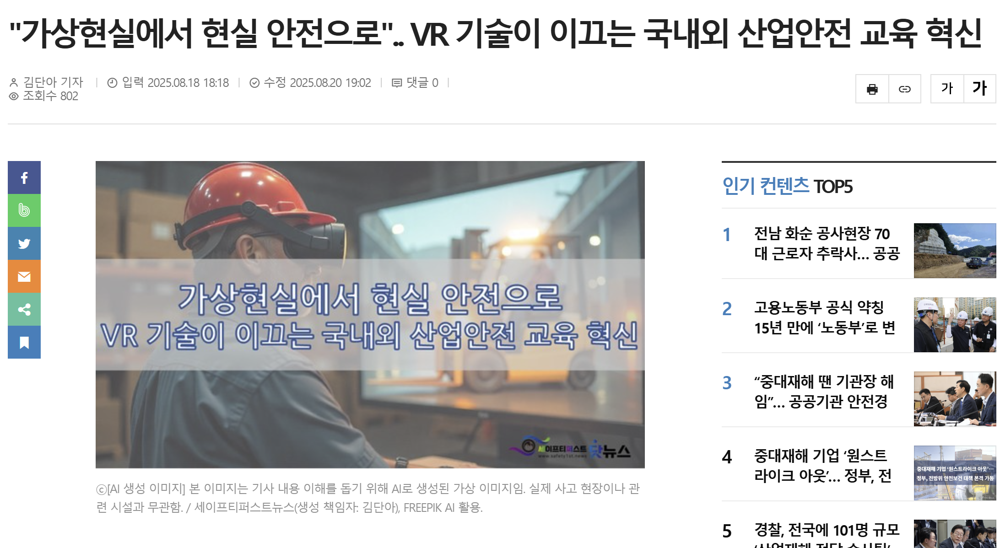

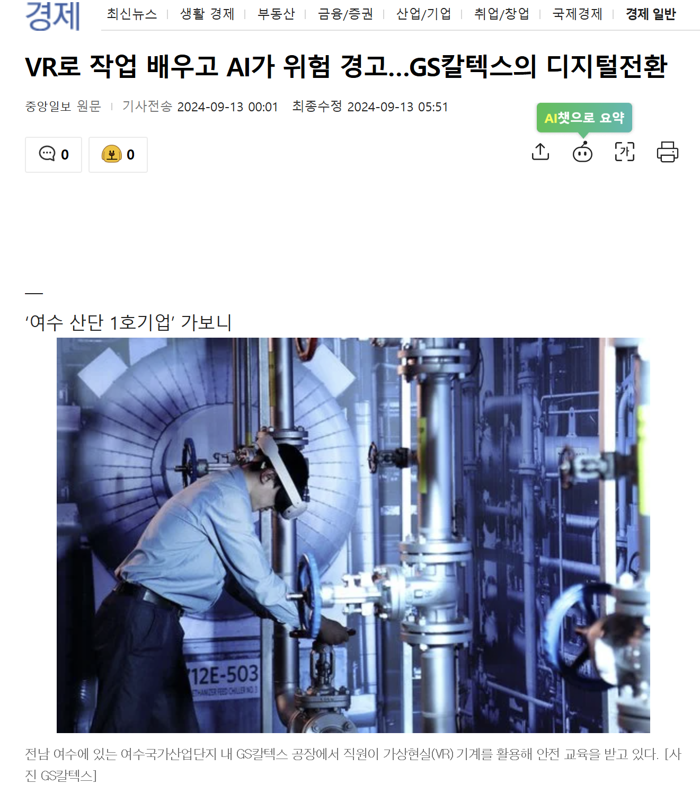

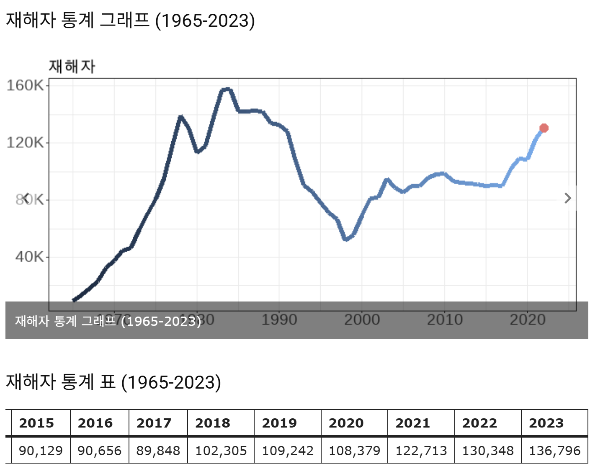

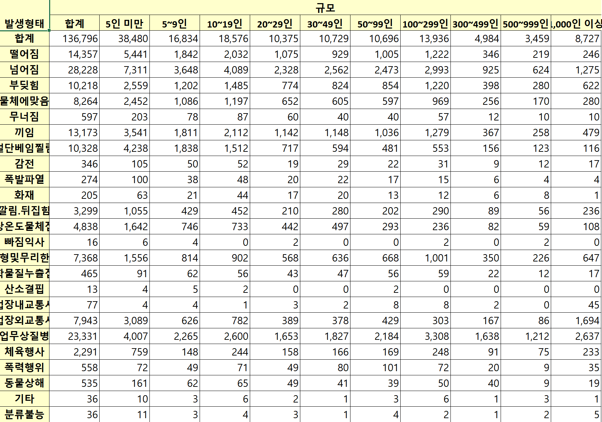

사용 시나리오  : 

언제 필요한지 : 

[사용목적/타깃](https://www.notion.so/263540dc8def80cbaab8f52dc2422033?pvs=21)
 

얼마나 가치 있는가? :  

시나리오 :